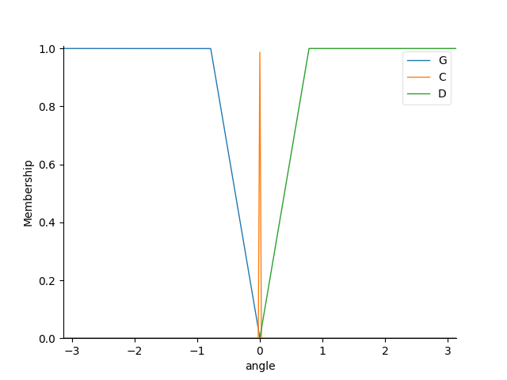

# Plan de test / verification

## Test Fuzzy

Pour tester la Logique Floue seule, lancer Fuzzy_logic.py . Le programme affiche uniquement les fonctions d'appartenances du controlleur flou.

Fonction d'appartenance de l'input : angle_goal-obstacle

Fonction d'appartenance de l'input : distance minimal joueur-obstacle

Fonction d'appartenance de l'output : angle_commande

## Test Prolog

Pour tester la base de données Prolog, lancer PrologCom.py . 

carte du labyrinthe :

['1', 'S', '1', '1', '1', '1']

['1', '0', '1', '1', '1', '1']

['1', '0', '1', '1', '1', '1']

['1', 'C', '1', '1', '1', '1']

['1', '0', '1', '1', '1', '1']

['1', 'O', '1', '1', '1', '1']

['1', '0', '1', '1', '1', '1']

['1', 'C', '1', '1', '1', '1']

['1', 'E', '1', '1', '1', '1']

Liste des coordonees (en case) des coins = 
	[(1, 3), (1, 7)]

Liste des coordonees (en case) des treasures = 
	[]

Coordonees (en case) de l'exit = 
	(1, 8)

Coordonees (en case) du start = 
	(1, 0)

Liste des coordonees (en case) des cases libres = 
	[(1, 1), (1, 2), (1, 4), (1, 6)]

Liste des coordonees (en case) des cases murs = 
	[(0, 0), (2, 0), (3, 0), (4, 0), (5, 0), (0, 1), (2, 1), (3, 1), (4, 1), (5, 1), (0, 2), (2, 2), (3, 2), (4, 2), (5, 2), (0, 3), (2, 3), (3, 3), (4, 3), (5, 3), (0, 4), (2, 4), (3, 4), (4, 4), (5, 4), (0, 5), (2, 5), (3, 5), (4, 5), (5, 5), (0, 6), (2, 6), (3, 6), (4, 6), (5, 6), (0, 7), (2, 7), (3, 7), (4, 7), (5, 7), (0, 8), (2, 8), (3, 8), (4, 8), (5, 8)]

Liste des coordonees (en case) des cases avec un obstacle = [(1, 5)]

Type de la case de coordonnees (1,0) : start

## Test Planification

Pour tester la planification, lancer Planification_search.py

## Test Genetic Algorithms

Pour tester l'algorithme génétique, lancer Train_genetic.py

